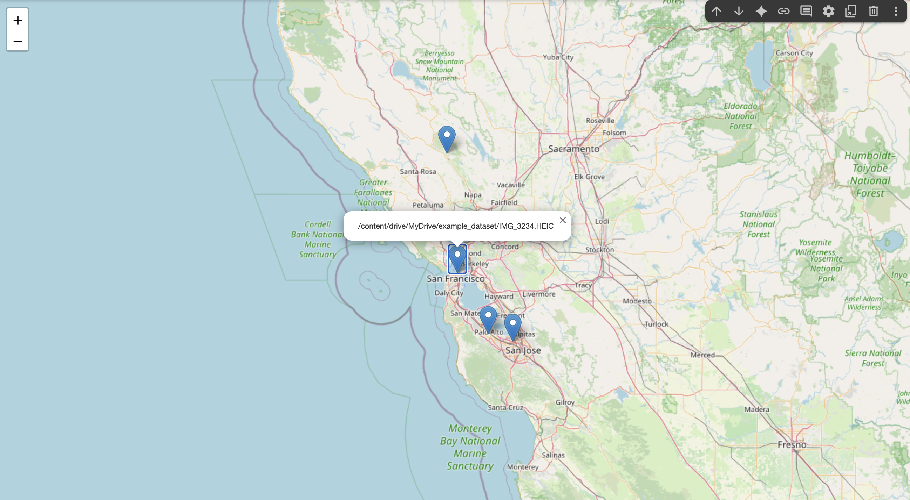

# MapEXIF-Colab
This repository provides a Google Colab notebook to read EXIF data (including GPS information) from images stored in a specific folder (e.g., on Google Drive) and visualize them on a map.



## Features
- Extract EXIF metadata (latitude, longitude) from HEIC images.
- Convert GPS coordinates from DMS (Degree/Minute/Second) to decimal format.
- Visualize locations on an interactive map using **folium**.
- Compatible with Google Colab + Google Drive workflow.

## Requirements
The notebook installs necessary libraries automatically, but the core dependencies are:

```bash
pip install folium
pip install exifread
```

## Usage
1. Open the notebook `MapEXIF_colab.ipynb` in **Google Colab**.
2. Mount Google Drive:
   ```python
   from google.colab import drive
   drive.mount('/content/drive')
   ```
3. Place your images (HEIC format) in a target folder inside your Drive.
4. Update the `img_directory` path in the notebook to match your image folder.
5. Run all cells.  
6. Visualize the extracted coordinates on an interactive map using **folium**.

## Example Output
- Console log of file names with GPS.
- Interactive map with markers at photo locations.

## File Structure
```
├── MapEXIF_colab.ipynb   # Main notebook
├── README.md             # This file
```

## Notes
- Works with iPhone images (HEIC) as well as other formats containing GPS EXIF metadata.
- If an image lacks GPS information, it will be skipped with a warning message.
- Altitude extraction may vary depending on EXIF data availability.

## License
MIT License
